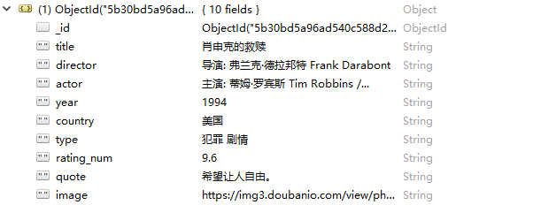
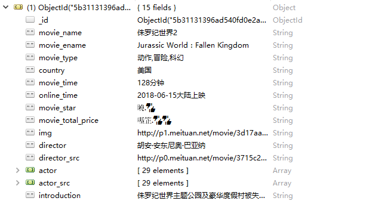
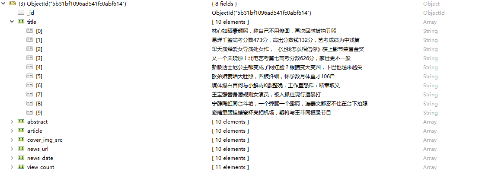
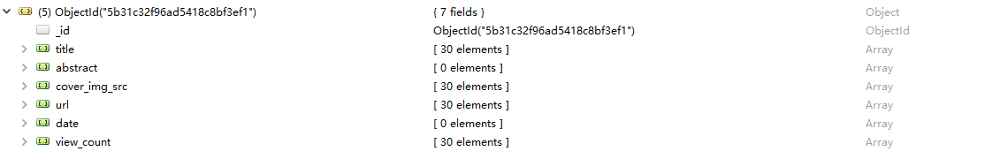
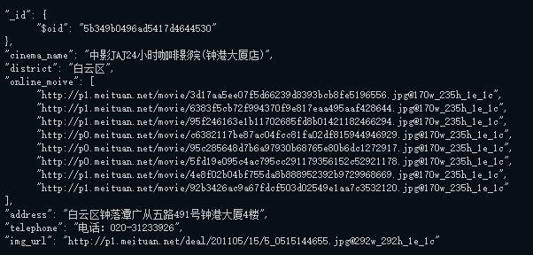
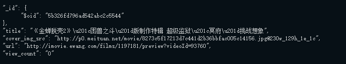

# Spider

### 1. 环境要求  
> 安装Python  
> 安装scrapy库：conda install scrapy  
> 安装pymongo库：conda install pymongo  
> 安装fontTools库   
> 安装MongoDB (可选)
> 

利用 mlab 平台配置云端MongoDB数据库

### 2. 执行  
爬取猫眼电影：在maoyan目录下，运行指令
```
scrapy crawl maoyan
```
爬去豆瓣电影TOP250：在douban250目录下，运行指令
```
scrapy crawl douban250
```
爬取热点资讯：在news目录下，运行指令
```
scrapy crawl MaoYanNews
```
爬取电影预告片：在video目录下，运行指令
```
scrapy crawl MaoYanVideos
```
### 3. 结果  
将爬取的结果写入MongoDB中

豆瓣电影存储格式： 

|database|maoyanmovies|
|:-: | :-: |
| collections | DouBan250 |
| id | id |
| title | 电影名字 |
| director | 导演 |
| actor | 演员 |
| year| 年份|
| country | 国家 |
| type |电影类型 |
| rating_num |豆瓣评分 |
| quote | 经典台词 |
| image | 电影剧照URL|

*所有的值都存储为String格式*

猫眼电影存储格式：

|database|maoyanmovies|
|:-: | :-: |
| collections | MaoYanMovies |
| id | id |
| movie_name | 电影名字 |
| movie_ename | 电影英文名字 |
| movie_type | 电影类型 |
| country | 国家 |
| movie_time | 电影时长 |
| online_time | 电影上映时间 |
| movie_star | 评分 |
| movie_total_price | 票房 |
| img | 电影剧照URL|
| director | 导演 |
| director_src | 导演照片URL |
| actor | 演员 |
| actor_src | 演员照片URL |
| introduction | 经典台词 |

*actor及actor的值存储为Array, 其他值均存储为String*  
*由于猫眼的电影的评分数据及票房数据均采用加密，爬取下来的数据均为乱码*  

热点资讯的存储格式为：

|database|maoyanmovies|
|:-: | :-: |
| collections | MaoYanNews |
| id | id |
| title | 新闻标题 |
| abstract | 新闻摘要 |
| article | 热点人物 |
| cover_img_src | 新闻封面图 |
| news_url | 新闻链接 |
| news_date | 新闻发布时间 |
| view_count | 新闻浏览人数 |

*每个值均为String*

*新闻连接不完整*


电影预告片的存储格式为：

|database|maoyanmovies|
|:-: | :-: |
| collections | MaoYanVideos |
| id | id |
| title | 视频标题 |
| cover_img_src | 新闻封面图 |
| url | 视频链接：链接到视频的预告片播放页面 |
| view_count | 视频播放数 |

*所有的值均存储为 String*  

电影院的存储格式为：

|database|maoyanmovies|
|:-: | :-: |
| collections | cinema |
| id | id |
| cinema_name | 电影院名字 |
| district | 行政区 |
| online_movie | 上映电影的图片地址 |
| address | 电影院地址 |
| telephone | 电话 |
| img_url | 电影院图片地址 |

*上映电影图片地址存储为Array，其他值均存储为 String*  


### 4. Robo 3T GUI工具（用于本地数据库）  
##### 豆瓣电影的第一项，如下图所示：  
  
##### 猫眼电影的第一项，如下图所示：

##### 热点资讯，如下图所示：
  
##### 新闻预告片，如下图所示：
 

### 5. 云端数据库示例
#### 电影表

#### 电影院表

#### 电影资讯表

#### 电影预告片表

